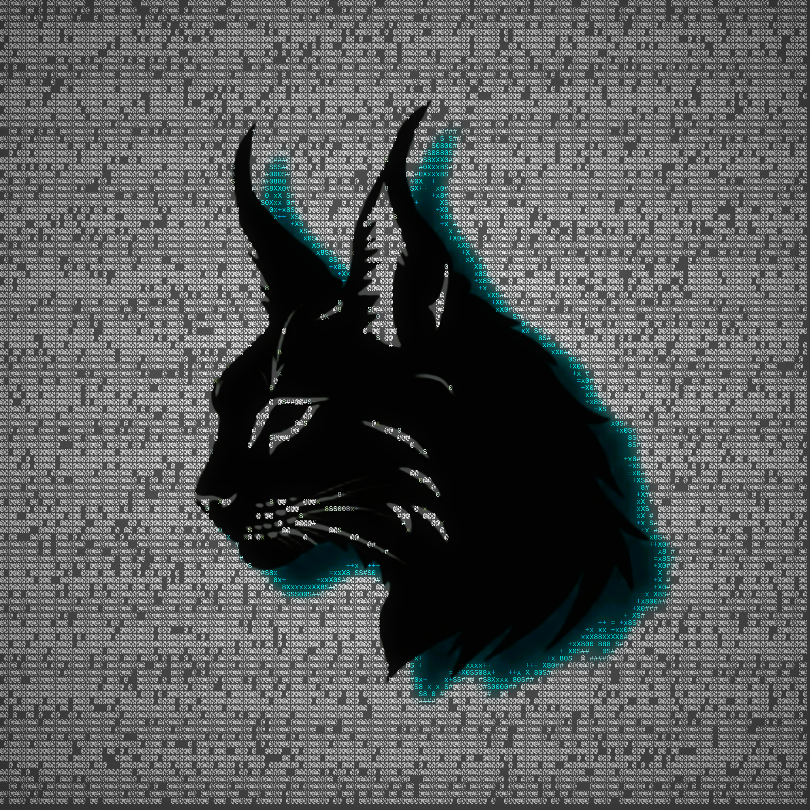
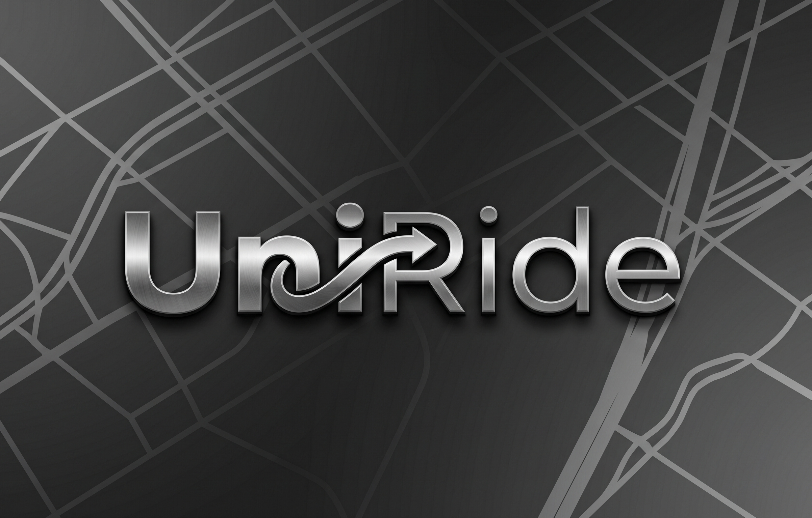

<table>
  <tr>
    <td width="38%" align="center" valign="top">
      
        
      <h2>Hi, I'm Dilan</h2>
      

        
        
        
      

    </td>
    <td width="62%" valign="top">
      <h2>Tech Stack</h2>
      
<b>Languages</b> 
        
        
        
        
        
        
        
        
        
        
        
      

      
<b>Scripting &amp; Shell</b> 
        
        
        
      

      
<b>Frontend</b> 
        
        
        
        
        
        
      

      
<b>Backend</b> 
        
        
        
        
        
        
        
      

      
<b>Databases</b> 
        
        
        
        
        
      

      
<b>Cloud &amp; Infrastructure</b> 
        
        
        
        
        
      

      
<b>Tools &amp; DevOps</b> 
        
        
        
        
      

      
<b>Media &amp; Design</b> 
        
        
        
        
        
      

    </td>
  </tr>
</table>

---

### About

> I am a technology-focused student with a strong interest in systems engineering, networking, and software development.
My work centers around building practical, scalable solutions across software platforms, infrastructure environments, and embedded systems.

I am currently developing a self-hosted homelab designed to operate as a:

- Network Attached Storage (NAS) platform
- Smart home automation hub
- Local AI processing environment

    

---

### GitHub Stats

  
  
   
  
   
  

---

### Areas of Focus

- Networking & Infrastructure
- Linux & Windows Systems
- Web & Mobile Application Development
- Robotics & IoT Systems
- Self-Hosted Systems / Homelabs

---

### One of My Best

**UniRide — Smart Travel Companion for University Students**

> UniRide is a cross-platform travel management system designed specifically for university students. It combines a Flutter mobile app, a React web application, and a hardware-based GPS tracking system to make campus transportation smarter, safer, and more reliable.

